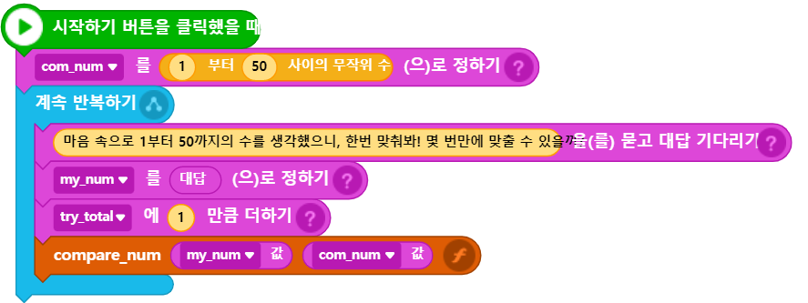

# 3.8 함수 (Function)

드디어 이제 마지막으로 이번 과의 마지막인 함수 파트만을 남겨두고 있다. 함수는 지금까지 이미 누가 우리를 위해 만들어 놓은 함수만을 호출해서 사용해 보았을 뿐, 나만의 내 함수(사용자 함수)를 직접 만들어 본적이 아직 없는데 이제 그 함수를 직접 만들어 보는 것을 해보도록 하겠다. [3.7 장](3.7-random.md)에서 만들었던 게임 코드의 일부를 함수로 별도 구현해 동일한 기능구현을 해보는 방식으로 함수를 배워보자.

먼저 코드 중에서 어떤 부분을 사용자 함수(사용자의 개인함수)로 따로 떼어내어 만들지를 정해야 하는데, 사용자가 입력한 수와 컴퓨터가 속의 생각한 수를 비교하는 부분을 떼어서 나만의 사용자 함수를 만들고 그쪽으로 두 수의 비교처리를 위임해 보도록 하자.



<figure><figcaption></figcaption></figure>



<figure><figcaption></figcaption></figure>




```python
# 엔트리봇 오브젝트의 파이선 코드
import Entry

com_num = 0
my_num = 0
try_total = 0

def when_start():
    com_num = random.randint(1, 50)
    
    while True:
        Entry.input("마음 속으로 1부터 50까지의 수를 생각했으니, 한번 맞춰봐! 몇 번만에 맞출 수 있을까?")
        my_num = Entry.answer()
        try_total += 1
        
        if my_num == com_num:
            Entry.print("Bingo! " + try_total + " 번 만에 찾아냈군!")
            Entry.stop_code("all")
        else:
            if my_num < com_num:
                Entry.print(my_num + " 보단 더 높은 수야")
            else:
                Entry.print(my_num + " 보단 더 낮은 수야")
            Entry.wait_for_sec(2)
```




<figure><figcaption></figcaption></figure>



<pre class="language-python" data-line-numbers><code class="lang-python"># 엔트리봇 오브젝트의 파이선 코드
import Entry

com_num = 0
my_num = 0
<strong>try_total = 0
</strong>
def compare_num(num1, num2):
    if num1 == num2:
        Entry.print("Bingo! " + try_total + " 번 만에 찾아냈군!")
        Entry.stop_code("all")
    else:
        if num1 &#x3C; num2:
            Entry.print(num1 + " 보단 더 높은 수야")
        else:
            Entry.print(num1 + " 보단 더 낮은 수야")
        Entry.wait_for_sec(2)

def when_start():
    com_num = random.randint(1, 50)
    
    while True:
        Entry.input("마음 속으로 1부터 50까지의 수를 생각했으니, 한번 맞춰봐! 몇 번만에 맞출 수 있을까?")
        my_num = Entry.answer()
        try_total += 1
    
        compare_num(my_num, com_num)
</code></pre>



우리가 이 과의 맨 [첫 장](3.1-hello-world.md)에서 함수를 어떻게 만드는지를 배웠기 때문에, 아직 함수 만드는 문법에 대한 이해가 부족하다면 [해당 과](3.1-hello-world.md#undefined-4)로 되돌아 가서 복습하고 돌아올 것을 권한다.

:1234: 8\~17번 라인의 코드가 [기존의 프로그램 코드](3.7-random.md#undefined-3)의 16\~24인을 떼어내어 compre\_num이란 사용자 함수를 만든 부분이다. 함수의 파라미터로 2개의 숫자값을 전달 받아오게 되어 함수 내부에서 그 두 수의 크기비교 결과에 따른 조건적 실행결과를 보여주게 된다. 함수를 만들고 사용하는 법을 이미 숙지했다면 전혀 이해에 어려움이 없는 부분이다.

다만, 해당 사용자 함수는 사실상 효용성이 많이 떨어지는 사용자 함수로서 왜냐하면 **함수의 주된 목적이 프로그램 코드 내에서 여러 부분에서 반복되어 되어 사용되는 기능을 하나의 함수로 대치하여 전체 코드의 간소화, 그에 따른 코드의 가독성 향상, 추후 발생할 수 있는 코드수정 대응에 용이성 등 여러가지 이점을 누리기 위한 목적**인데, 방금 만들어낸 사용자 함수의 경우는 그 목적에 크게 부합하지는 못하는 단순 학습목적의 사용자 함수로 나만의 함수를 직접 만들어 보고 사용해 보기 위한 인위적인 예시 목적이 더 크다고 할 수 있겠다.

그밖에 **사용자 함수가 더 많은 곳에서 활용되기 위해서는 가능한한 보편적 기능을 구현할 수록 좋은데** 예를들어, 지금처럼 크기비교+비교결과의 화면출력까지 묶어서 기능구현하는 것보다(이처럼 여러 기능이 하나로 묶일 경우, 특정 코드에서만 제한적으로 사용가능하게 되는 단점이 발생) 단순히 크기비교 기능만을 별도 개별 구현한 함수가 되는 것이 함수 활용성을 높일 더 좋은 구현이나 아쉽게도 현재 엔트리-파이썬 수준에서는 이런식의 파이썬 코드구현이 불가능한 한계(함수 결과값을 함수 호출자에게 회신(리턴)하는 기능의 미구현)가 있어서 불가피한 구현이 되었음을 염두해 두길 바란다.

그밖에 위와 같이 함수를 코딩한 후에 시작하기 버튼을 눌러 앱을 실행 후 다시 종료했을 때, 방금 전에 작성한 나의 함수코드가 갑자기 사라져버린 것처럼 보이는데, 실은 해당함수는 블록코딩 내의 함수 카테고리 안으로 자동등록되어 버리면서 코드가 그쪽으로 옮겨져 버린 것이다. 이 부분 역시도 아쉽게도 엔트리-파이썬에서 함수코딩시 사용자 입장에서는 혼동될 수 있는 부분이다.
