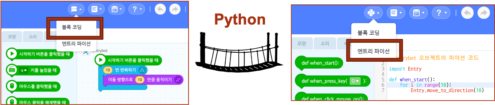

# 2. 엔트리-파이썬의 시작

## 엔트리 (블록 코딩) <-> 파이썬 (텍스트 코딩) 변환 

이미 엔트리 사용자라면 엔트리에 대한 사전 지식을 통해서든 엔트리 작동법을 탐구 중 우연히 해당 기능을 발견했을 수도 있을 것이다. 엔트리 상단 메뉴바에서 코드변환 아이콘을 눌러 두 코드 간의 전환을 시도 하면 된다.

<figure><figcaption></figcaption></figure>

이처럼 엔트리는 나의 블록코딩의 언어가 텍스트 코딩언어(파이썬)로는 어떻게 되는지를 코드 변환을 통해 확인해 볼 수 있을 뿐만 아니라, 엔트리-파이썬 코딩 에디터 창을 통해 직접 텍스트 코딩을 하고 이를 실행해 볼 수 있는 기능까지도 제공한다. 이러한 "엔트리-파이썬"은 학습자나 교사가 엔트리에서 "블록 코딩에서 시작해 텍스트 코딩까지 익히기" 라는 목표를 이룰 수 있도록 그 중간을 매개하는 연결다리와 같은 역할이라 할 수 있을 것이다.&#x20;

## 블록코딩에서 첫 텍스트코딩으로 넘어오면서 겪는 경험 

일반적으로 블록코딩에서 첫 텍스트코딩으로 넘어오면서 겪는 큰 당혹감은 기존에 블록코딩에서처럼 단순히 블록 카테고리에 위치한 블록들을 코딩에디터(코드조립소) 영역으로 옮겨 놓으면서(Drag & Drop) 조립하면서 의미있는 블록더미를 만드는 이해하기 쉽고 직관적이고 편리한 방식으로 코딩할 수는 없고, 대신에 마치 긴 글을 작문하듯이 글자 하나하나를 일일이 수많은 텍스트 타이핑을 하면서 코딩해 나가야 한다는 것이다.&#x20;

이때 우리는 이러한 코딩과정에서 기존 블록코딩에서는 경험해 보지 못한 에러(error) 상황들을 마주치게 되며, 그 사소해 보이는 에러(또는 오류)가 내가 코딩한 프로그램 전체를 아예 실행할 수 없게 만든 것은 다소 당혹스럽게 느껴지기 까지 하다. 왜냐면 기존 블록코딩에서는 코딩을 잘못할 경우, 프로그램이 오동작 하는 정도이지 아예 전체가 실행이 불가하지는 않았기 때문이다. &#x20;

**에러는 타이핑한 텍스트가 오타인 경우엔 이해가 되나 오타라기 보다 겨우 알파벳 대소문자 정도의 차이, 점 하나를 찍고 안찍고의 차이임에도 불구하고, 프로그램을 실행하려고 하면 그것을 에러라고 내뱉으며 프로그램 자체를 아예 실행할 수 없게 된다. 텍스트 코딩은 그런 면에서 매우 주의깊고 정확성 있는 코딩이 필요하고, 그 외에도 내가  코딩하는 내용 자체가 해당 코딩언어가 요구하는 문법 체계와도 맞는지까지 한번 더 주의를 살펴 코딩해야 한다.** _이러한 면 때문에 처음에 겪는 당혹감은 누구에게나 당연한 것이고, 다만, 이러한 코딩방식에 적응되고 익숙해지기 까지는 모두에게 어느 정도의 시간이 필요한게 사실이다._

## 엔트리-파이썬에서 드래그엔드롭(Drag\&Drop) 방식으로 코딩하기 

엔트리-파이썬에서는 위에서 언급한 텍스트 코딩시 겪게 되는 타이핑 오류로 인한 실수를 막을 수 있는 방법의 아이디어로 기존 블록코딩에서의 코딩방법을 차용해 그림에서처럼 드래그엔드롭 방식으로 코딩을 시도해 볼 수 있다.

<figure><figcaption></figcaption></figure>

이러한 방법이 단순 타이핑 실수로 인한 에러를 줄여주는 효과와 키보드 타이핑하는 시간자체를 줄여주는데는 편리함이 있지만, 그렇다 할지라도 위에서 언급한데로 텍스트코딩시 사전에 필수로 알아야 하는 해당 코딩언어의 문법체계는 사전에 잘 알고 있다는 전제를 가졌을 때에만 활용할 수 있는 코딩방법이라고 할 수 있다. 그러므로 이제 우리가 우선적으로 해야할 일을 파이썬 언어의 기본 문법체계를 익히는 일부터 시작해야 할 것이고, 다음 징부터 이를 하나씩하나씩 차근차근 배워보도록 하겠다.
