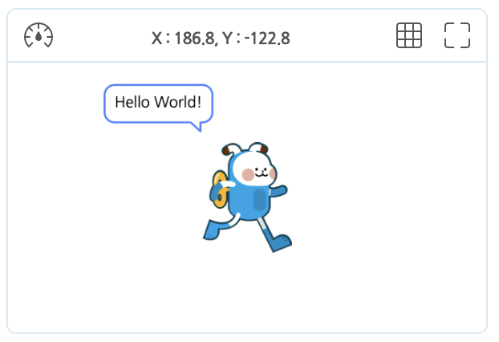
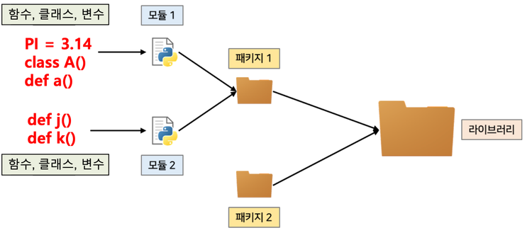
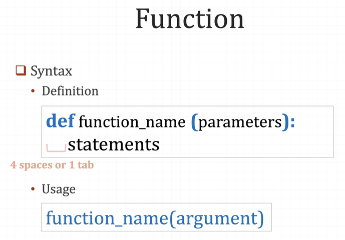

# 3.1 Hello World 예제코드의 이해

아마 다른 종류에 컴퓨터 코딩언어 책을 본 경험이 있다면, ["Hello World!" 라는 한 문장을 화면에 출력하는 아주 간단한 내용을 코딩한 예제코드](https://ko.wikipedia.org/wiki/%22Hello,_World!%22_%ED%94%84%EB%A1%9C%EA%B7%B8%EB%9E%A8)의 분석에서 출발하는 것을 본적이 있을 것이다. 우리도 역시 전형적인 이 예제 코드로부터 시작해 문법 익히기를 시작해보자.

### 실행결과



### 블록코딩


### 엔트리-파이썬

```python
 1 | # 엔트리봇 오브젝트의 파이선 코드
 2 |
 3 | import Entry
 4 |
 5 | def when_start():
 6 |     Entry.print("Hello World!")
```

앞으로 코드분석은 위와 같이 3개의 탭 형태로 구성하되 맨 처음 탭은 해당 코드의 실행결과를 나타내고, 중간과 마지막 탭은 엔트리-파이썬 / 블록코딩 형태의 코드로 동일한 실행결과를 얻기 위한 각각의 코드를 비교해 볼 수 있도록 구성하였다.

이 예제의 경우 블록코딩으로는 단 2개의 블록 만으로 코딩되는 아주 단순한 프로그램이다. 하지만, 이를 엔트리-파이썬으로 코딩했을 때는 무려(?) 6라인(줄)으로 구성된 코드(코드 가독성을 높이기 위해 넣은 중간마다 넣은 공백라인 포함)로 길어지게 된다. 당장은 여러분에게 이 예제를 직접 타이핑 해볼 것을 권하지 않겠다. 코딩은 이후에 얼마든지 할 기회가 있고, 먼저는 텍스트 코딩예제로서 가장 쉬운 코드라 불리는 이 6라인의 의미를 명확히 이해하는 것이 더 중요하다. 따라서, 여러분은 지금 당장은 이 내용을 블록코딩으로 코딩하고 이후 메뉴에 자동 코드변환하기 메뉴를 선택해 엔트리-파이썬 코드로 변환시켜보기 바란다.

🔢 **1번 라인**의 "_# Entrybot 오브젝트의 파이선 코드"_ 의 의미는 무엇인가? **텍스트 코딩에서는 기호 하나하나 심지어 때론 공백까지도 어떤 의미와 목적을 갖고 있다는 것을 알고 있을 것이다.** 따라서, 1번 라인에 처음 등장하는 _**#**_ 의 기호 역시 의미와 목적이 있을 것이라는 것을 유추할 수 있고, 현재 _**#**_ 기호 뒤에 적혀진 내용을 통해 미루어 짐작해 볼 수 있는데, "이 기호로 시작해 이후로(단, 한 라인 이내) 적는 내용들을 주석(comment)이라고 간주하라" 라는 의미가 된다.

> [!NOTE]
> 텍스트 코딩에서 **주석(comment)**이라는 것의 의미를 이해해보자.컴퓨터는 우리가 작성한 코드를 최종 실행을 위해 결국에는 실행과정에서 하나하나 해독해 나가게 되는데, 주석이란 부분을 만나면 그 부분은 실행과는 전혀 상관없는 것이니 해독없이 그냥 무시하고 지나가라는 우리편에서의 의미전달로 받아드리고, 컴퓨터는 그 부분을 해독없이 건너 뛰어(skip) 지나간다.

그렇다면 **주석은 왜 필요할까? 목적은 크게 2가지인데,** 하나는 주석이란 그 말 자체가 갖는 의미대로 우리가 작성한 코드를 설명하는 즉, 추가적인 정보를 담아서 나중에 저자 본인이나 우리 동료들이 이 코드를 보았을 때, 빠르고 옳바르게 이해할 수 있게 돕는 목적의 보충설명을 다는 용도이다. 두 번째는 코드의 논리적 오류(문법상의 오류는 없으나, 실행시 의도한데로 수행하지 못하는 오류)를 디버깅(Debugging, 오류를 찾아고치는 과정) 하는 과정에서, 임시로 내 코드의 일부를 주석처리 함으로써 실행과정에서 임시로 내 코드의 일부를 수행없이 건너뛰어(skip) 지나가게 하면서 오류를 빨리 찾아내기 위한 목적에서 사용한다.

🔢 그 다음 **2번 라인**의 분석으로 넘어가자. 그냥 공백으로 비워둔 라인이다. 이러한 라인은 2, 4라인으로 총 2라인이 있다. 왜 공백 한 라인을 넣었는가? 이유는 간단한다. 컴퓨터가 코드해독시 의미를 주기 위한 목적은 전혀 없고, 인간인 우리편에서 코드를 읽을 때 한눈에 잘 들어와 읽히게 하려는 **가독성**을 주려는 목적에서다. 그런데 가독성은 생각보다 매우 중요한데, 우리는 이제 막 텍스트코딩에 입문한 입문자라 잘 와닿지 않겠지만, 조금만 규모가 있는 프로그램 개발로 넘어가면 나 혼자 개발하는게 아니라, 다른 개발자들과 협업하는게 일반적이다. 그래서, 다른 사람이 나의 코드를 쉽고 빠르고 편하게 읽을 수 있게 늘 배려하는 습관을 몸에 베게 하는게 필요하다. 이는 개발자들에겐 빠져서는 안 될 필수덕목이라 할 수 있겠다. 그래서, **코딩을 하면서 적절하게 공백라인을 사용하고, 또 적절하게 주석을 사용하는 일은 매우 중요**하다.

🔢 이제 **3번 라인**으로 넘어가자. _**import Entry**_ 라는 두 단어를 맞났는데, 이 문장에서 import 키워드의 의미는 라이브러리(Library, 파이썬에서는 패키지(package), 그보다 더 작은 단위 모듈(Module)이라고도 불림)를 우리가 현재 코딩하는 파일의 외부에서 가져다가(import해서) 코딩에 활용해 쓰려고 한다라는 것이고, 그 위에 오는 Entry라는 단어는 우리가 필요한 라이브러리의 이름인데, 전체적으로 이 코드의 의미는 Entry(라이브러리의 이름은 그 라이브러리의 저자가 임의로 부여하게 됨) 라는 라이브러리를 외부로부터 호출해 가져와달라는 의미이다. 그렇다면 이제 라이브러리가 무엇인지 알아볼 차례이다.

## 라이브러리란

> [!NOTE]
> **라이브러리(Library)**: [소프트웨어를 개발할](https://ko.wikipedia.org/wiki/%EC%86%8C%ED%94%84%ED%8A%B8%EC%9B%A8%EC%96%B4_%EA%B0%9C%EB%B0%9C) 때 [컴퓨터 프로그램](https://ko.wikipedia.org/wiki/%EC%BB%B4%ED%93%A8%ED%84%B0_%ED%94%84%EB%A1%9C%EA%B7%B8%EB%9E%A8)이 사용하는 [비휘발성 자원](https://ko.wikipedia.org/wiki/%EB%B9%84%ED%9C%98%EB%B0%9C%EC%84%B1_%EB%A9%94%EB%AA%A8%EB%A6%AC)의 모임이다. 여기에는 구성 데이터, 문서, 도움말 자료, 메시지 틀, [미리 작성된 코드](https://ko.wikipedia.org/wiki/%EC%BD%94%EB%93%9C_%EC%9E%AC%EC%82%AC%EC%9A%A9), [서브루틴](https://ko.wikipedia.org/wiki/%EC%84%9C%EB%B8%8C%EB%A3%A8%ED%8B%B4)(함수), [클래스](<https://ko.wikipedia.org/wiki/%ED%81%B4%EB%9E%98%EC%8A%A4_(%EC%BB%B4%ED%93%A8%ED%84%B0_%EA%B3%BC%ED%95%99)>), [값](<https://ko.wikipedia.org/wiki/%EA%B0%92_(%EC%BB%B4%ED%93%A8%ED%84%B0_%EA%B3%BC%ED%95%99)>), [자료형](https://ko.wikipedia.org/wiki/%EC%9E%90%EB%A3%8C%ED%98%95) 사양을 포함할 수 있다.
>
> 출처: 위키피디아

위에 라이브러리의 정의를 읽고 이해가 되었는가? **라이브러리를 간단히 설명하면** **개발자들이 프로그램 개발시 빠르고 편리하게 개발하기 위한 목적으로 미리 작성해 놓은 코드덩어리들(주로 함수, 클래스, 변수 등)의 모음**이라고 얘기할 수 있다. 당신은 이미 엔트리에서 함수(Function)를 사용해 봤고, 함수의 존재 목적에 대해 잘 이해하고 있는가? 함수의 주 목적이 무엇이었던가? 여러 곳에서 반복해서 사용하게 되는 코드덩어리를 함수로 만들어 놓게 되면, 이후에는 그 함수블록 1개의 호출만으로 우리가 원하는 기능을 손쉽게 구현이 가능하여 코딩자체가 매우 간소화 되어 코딩의 효율이 증가하는 효과와 동시에 함수로 인해 간소화된 코드는 코드전체의 이해도 크게 증가하는 것을 경험했을 것이다.

그 밖에 **함수의 더 유용하고 본질적인 목적은 한번 잘 만들어둔 함수를 프로그램 전체 코드 내 여러 곳에서(한 개의 오브젝트 또는 다량의 오브젝트 안에서) 사용함으로써(이를 코드의 재사용성이라 함) 한번 만들어진 프로그램이 이후의 변경(프로그램은 마치 살아있는 개체로서 한번 만들어지고 끝이 아닌 계속 반복적인 수정을 통해 발전진화해 나가는 과정을 겪음)에 대해 손쉽게 대응하려는 목적이 더 크다.** 왜냐면 특정 기능을 함수로 만들고, 그 특정기능의 개선을 위해 함수자체의 내용을 수정하게 되면, 그 함수를 사용해 코딩한 모든 코드에서 한꺼번에 동일한 반영이 적용되기 때문이다.

혹시 지금 위해서 언급된 함수의 목적과 의미를 잘 이해하지 못하였다면, 귀하는 엔트리 블록코딩에서 함수를 사용해 코딩해 본 적이 없거나 함수의 존재목적을 잘 이해하지 못한체 사용했을 가능성이 크다. 여기서 함수개념 자체를 다시 재설명하는 것은 본 서의 범위를 넘어서는 것으로, 참고할 수 있는 [동영상 링크](https://www.youtube.com/watch?v=XRBg448VYzU)를 남기니 필요한 분은 개인적으로 독학하는 것으로 갈음하겠다.

잘 만든 함수 하나가 얼마나 유용한지 경험했다면, 이제 이러한 고민이 시작될 수 있다. 그 함수를 나 혼자만 쓰긴 너무 아깝지 않은가? 모든 개발자들이 작게는 우리 동료들이, 아니면 전세계의 모든 개발자가 다같이 함께 쓰면 쓸수록 더 좋은게 아닌가. 그래서, 그 잘 만들어진 유용한 함수들을 모두가 함께 쓰는 구조를 만들기 시작했는데 그게 라이브러리(또는 패키지)라고 불린다. 개발자들은 특히나 늘 이런 것에 관심이 많다. 왜냐면 그들은 기본적으로 다 극도의 효율성 추구자들이기 때문이다^^; 먼저, 개별 함수들을 한 곳에 모으고, 다시 함수들을 모은 그것을 또 한 군데 모아나가면서 구조를 만든다. 이를 그림으로 표현해 보면 다음과 같다.



_이해하기 쉬운 적절한 비유로 무엇이 있을까 고민했을 때, 라이브러리(library)는 말을 붙인 의도가 있을 것 같은데, 말그대로 도서관이고 도서관은 책들로 가득한데, 개별적인 단행본 개념의 단권짜리 책도 있지만, 때로는 시리즈물 전집책도 상당히 있는데, 그런 전집류를 패키지(package)라고 생각해 볼 수 있고, 단 권짜리 책들은 모듈(module), 마지막으로 책 안에는 책의 내용을 구성하면서 의미단위를 만드는 장, 절, 단락, 문장 등이 있는데 이것들을 클래스, 함수, 변수 등으로 비교해 설명해도 무리가 없지 않을까 한다._

_지금은 그냥 라이브러리 안에는 우릴 위해 미리 남들이 개발해 놓은 유용한 코드뭉치(특별히 주로 함수들)로 가득하고, 우리는 그냥 그것을 가져다가 활용해 코딩을 한다 정도로만 알고 있어도 충분할 것 같다._

🔢 드디어 **5번 라인**에 도달했다. 이게 코드분석의 마지막이라고 생각해도 좋다. 왜냐면 5\~6번 라인은 별개로 분리된 코드가 아닌 하나의 의미를 갖는 코드뭉치이기 때문이다.

```python
5 | def when_start():
6 |     Entry.print("Hello World!")
```

_**def when_start():**_ 이 코드의 의미는 무엇일까? 앞에서 이미 수차례 언급된 바로 그 함수라는 것을 직접 만들고 있는 코드이다. 초장부터 함수를 이용하기 위해 외부에서 부르는 방법을 익히더니 이젠 직접 만드는 방법까지! 그만큼 텍스트 코딩에서는 함수가 필수적인 개념이다. 우선 파이썬 텍스트코딩에서 일반적인 함수 만드는 문법을 알아보자.

## 함수 만드는(정의하는) 법



위에 표준문법의 각 단어와 기호의 의미를 이해해 보자. _함수를 만들려면 문두 시작에 항상 def(definition의 약자)라는 키워드를 달고 시작한다._ 이제부터 내가 적는 내용은 함수를 만드는(정의(definition)하는 거야라고 의미표현이다. 그리고, 이어서 내가 만들 함수의 이름을 의미있게 임의로 적는다. 그리고, 그 함수 호출시 호출자로부터 넘겨받을 값들(이를 프로그래밍 세계에서 파마리터라고 부름)을 괄호 안에 쉼표(,) 구분자를 사용해 나열한다. 그리고, 마지막에 콜론(:)를 기호를 입력함으로써 여기까지 함수뼈대의 끝이고, 이제 다음 라인부터는 함수 안에서 실제 수행해야할 코드내용이 채워질꺼라는 의미가 부여된다.

> [!NOTE]
> **파라미터(parameter)와 아규먼트(argument) 차이**
>
> **파라미터(parameter)**
>
> - 파라미터는 함수를 정의할 때 사용되는 변수입니다.
> - 함수 정의에서 괄호 안에 나열되는 변수들을 의미합니다.
>
> **아규먼트 (Argument)**
>
> - 아규먼트는 함수를 호출할 때 실제로 전달되는 값입니다.
> - 함수 호출 시 괄호 안에 전달되는 실제 값들을 의미합니다.

_**def when_start():**_ 를 위에 표준문법에 다시한번 빗대어 설명해 보면 when_start 라는 이름을 갖는 함수를 만드는데, 그 함수에 전달되어질 값(파마리터)은 전혀 없는(그래서, 괄호 안은 비워져있다) 함수를 만들겠다 라는 것이다.

🔢 이제 마지막 **6번 라인**으로 넘어가면 이 함수가 불려졌을 때 수행해야하 할 내용을 적는데, _특이한 것은 다른 라인들과 달리 문두 시작전에 앞에 어느 정도의 공백을 띄우고(Tab키를 1회 눌러 한번에 공백을 만들거나 또는 스페이스바를 4회눌러 4개의 공백을 넣음) 코드를 적기 시작한다는 것이다._ 앞서 프로그래밍 세계에서 공백조차도 때론 어떤 의미를 갖는다고 언급했었는데 바로 이런 경우의 공백으로서 파이썬 표준문법에 존재하는 의도성을 갖는 공백이다. 함수에서만 쓰이는게 아니라, 이후 다른 여러 코드뭉치에서 반복해서 사용될 것이니, 처음부터 잘 알아두자. **이 공백의 의미를 간단히 설명하면, 매 라인마다 같은 크기의 공백을 둠으로써 각 라인은 서로 묶여진 한 코드덩어리임을 나타내기 위한 목적이다.**

이를 우리 코드에 빗대어 보면 즉, when_start라는 함수에 속한 코드가 어디서부터 어디까지인지를 컴퓨터에게 알려주기 위해 공백을 사용한 것이다. 지금 이 함수는 호출되면 그 안에 딱 1개의 라인만 수행하는 너무 간단한 함수라 이 말이 잘 와닿지 않을 수 있는데, 추후에 더 많은 코드를 수행하는 수행내용이 긴 함수를 보면 더 잘 의미가 와닿을 것이다.

마지막으로 _**Entry.print("Hello World!")**_ 을 분석하자. 하나씩 뜯어보면, Entry라는 라이브러리 이름을 적었고, 이후에 점(.)을 찍었고, 이후에 print("Hello World!") 를 적었다. 앞서 프로그래밍 세계에서 점(.) 하나도 의미가 있다고 했는데, _**Entry.**_ 라고 라이브러리 이름에 점을 찍으면, 그 라이브러리 안에 있는 것들 즉 함수(또는 클래스, 변수 등)를 사용하겠다는 의미이고, 그 뒤에 연이어 적인 ***print("Hello World")***가 바로 Entry 라이브러리 안에 위치한 함수이다. 결국 이 라인에 적힌 코드의 의미는 1번 라인에서 import해 가져온 Entry 라이브러리 안에 위치한 print라는 함수를 호출해 사용하겠다는 의미이다. print라고 이름지어진 뜻에서 유추할 수 있듯이, 화면에 어떤 값을 출력하는 용도이고, 출력할 내용은 "(큰따옴표)안에 적음으로써 화면표기될 내용의 시작이 어디고 끝인지를 의미표기해 전달한 것이다.

휴\~ 이로써 6라인짜리 아주 간단한 프로그램의 코드분석은 다 끝났다! 속시원한가? 엔트리의 "시작하기" 버튼을 누르면 저 6라인의 코드가 실행되면서 화면에 우리가 원하는 결과(Hello World! 라고 말하기)가 출력되는가? 잘 출력될 것이다. 코드가 다 해석되었고, 실행도 잘된다. 그럼에도 당신에겐 속시원하지 않고 뭔가 다 해결되지 않은 의문의 찜찜함이 여전히 남아야 한다. 남았는가? 남지 않았다 하더라도 실망하지 말자.

남아야 하는 의문은 우리의 단지 이 6라인짜리 코드에서 과연 어떻게 원하는데로 동작하는 결과가 나왔지? 라고 오히려 의아해 해야 하는 것이다. 원하는 결과가 나오기에는 사실상 코드가 완전하지는 않기 때문이다. 분명히 코드가 더 있어야 되는데 말이다. 우리는 when_start 함수를 정의만 했지 사용하기 위해 이를 호출한 코드는 어디에도 존재하지 않기 때문이다. 구체적으로 when_start 함수를 내 코드 안에 어딘가에서는 호출을 해야하고 그래야 그 호출에 의해 함수가 실행되면서 화면출력이 이뤄지는 것인데, 그런데 우리 6라인짜리 프로그램 내 코드 안 어디서도 when_start함수를 직접 호출하는 코드는 없다. 그렇다면 저 함수는 누가 호출해서 어떻게 실행이 된 것이란 말인가??

## 콜백함수란

답을 말하면, 우리 프로그램 내 코드에서 직접 호출한게 아니라 우리 프로그램 밖의 외부에서 저 함수의 호출이 이뤄진 것이다. 그렇다면 누가?? 그렇다. 호출자는 바로 엔트리 프로그램 그 자신이다. 엔트리가 우리 함수 when_start를 자동으로 호출한거다. 여기서 상식으로 알아두면 좋을 용어하나가 등장하는데 이와같이 함수긴 함수인데 내가 직접 호출이 없이 외부에서 어떤 시점에 자동호출되는 함수를 **콜백(callback)**함수라고 부른다. 그렇다, when_start는 콜백함수였던 것이다. 이러한 콜백함수는 함수 이름을 우리 맘대로 정할 수 없다. 엔트리 자신이 이미 정해놓은 함수이름을 그대로 사용해야만 하는 것인데 즉, 엔트리 내부적으로 어떤 약속이 되어 있냐면, 사용자가 "시작하기" 버튼을 누르는 즉시, 엔트리는 내부적으로 항상 when_start 함수를 호출하기로 코딩되어져 있는 것이다. 혹시 이 말을 믿지 못하겠다면, when_start 라는 함수이름을 의도적으로 다른 것으로 바꾼 후, "시작하기" 버튼을 눌러보도록 하자. 기대했던 동작이 이뤄지는가? 정상적인 실행이 되지 않을 것이다. 우리 프로그램 안에는 사전 약속되어진 필수로 존재해야만 하는 바로 그 when_start 함수가 존재하지 않기 때문이다.

단지, 6라인짜리 작은 프로그램이었지만, 텍스트 코딩의 많은 핵심을 이해할 수 있는 좋은 예제였음에 틀림이 없다. 다음 단계로 프로그래밍을 구성하는 핵심요소(순차, 반복, 조건 등등)들을 하나 하나씩 격파해 나가도록 하자.
