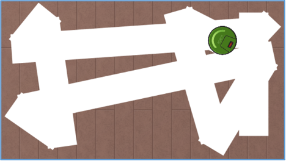

# 4.1 순차/병렬처리 (Serial/Parallel)

**순차/병렬처리에 대한 개념은 사실은 프로그래밍의 패러다임까지는 아니다. 간단히 말하면 어떠한 일을 처리하는 순서로 복수업무를 순차적으로 처리할 것인가, 동시에 처리할 것인가 정도로 구분하면 되겠다.**

순차처리(Serial processing)는 코드 한줄 한줄 순차적으로 수행된다는 것으로 언플러그드(unplugged) 교딩교육에서도 가장 기본으로 다루는 개념으로 사실상 우리가 너무 익히 잘 아는 개념이라 따로 설명이 필요없고, 병렬처리(Parallel processing)라는 컴퓨터공학의 원론적인 개념으로 설명하기 시작하면 초보자 수준에서 이해하기 어렵고, 또 엔트리-파이썬에서 그러한 수준에 병렬처리를 지원하지도 않아서, 간단히 개념적으로만 이해하고 넘어가도 좋겠다. **병렬처리는 복수의 둘 이상의 작업을 동시에 실행할 수 있는 방식**이라고 말했다. 이때 진짜 각각의 작업들이 완전히 독립적으로 개별로 실행되는거냐(병렬성, Parallelism), 마치 작업들이 동시에 실행되는 거처럼 보이게 하는 테크닉(동시성, Concurrency)으로 실행되게 하는 것이냐에 따라 구분이 많이 달라지는데, 엔트리-파이썬은 후자라고 하겠다.

엔트리-파이썬에서는 동시성(concurrency) 처리 프로그래밍시 사용하는 일반적인 기법(쓰레드, 멀티 프로세스 등)을 사용해 코딩할 수 조차 없으니 당연히 동시성 텍스트코딩하는 방법도 배울 수가 없다. 이 책의 서두에서도 언급했지만, 엔트리-파이썬의 갖는 한계임과 동시에 애시당초 엔트리-파이썬에서 그정도까지의 학습을 의도하지 않았고, 블록코딩에서 첫 텍스트코딩의 넘어가는 분들이 대상이라 개념적 이해만 하고 넘어가도 충분하고, 사실상 그것만으로 가치는 분명히 있다는 것을 알면 좋겠다.

엔트리 블록코딩에서 다음의 예제와 같이 우리는 이미 병렬처리를 많이 코딩해봤다.

### 실행결과

### 블록코딩

### 엔트리-파이썬

"시작하기 버튼을 클릭했을 때" 라는 블록을 한 오브젝트 내에서도 여러 개 사용해 독립적으로 보이는 작업들을 마치 동시에 처리하듯이 코딩해본 경험이 있는 것이다. 이처럼 우리는 여러가지 프로그래밍의 핵심개념들을 알게 모르게 사용해왔던 것이다.

따라서, 엔트리-파이썬에서의 병렬처리는 블록코딩에서 해본 것과 크게 다르지 않다. 단지, 위의 예저처럼 when_start 함수를 두번 이상 사용할 수 있어, 사용자가 프로그램을 시작하기 위해 시작하기 버튼을 누름과 동시에 각각 when_start 함수가 동시에 불려지기 때문에 그 함수 호출시 수행해야 할 여러작업을 독립적으로 기술하고, 마치 동시에 실행되는 것 같은 효과를 누리도록 코딩하고 활용할 수 있으면 되겠다.
